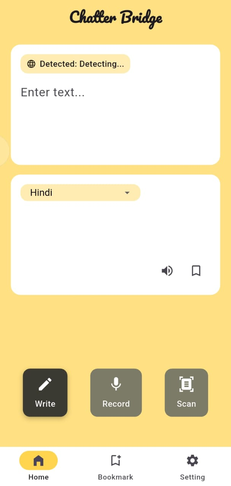
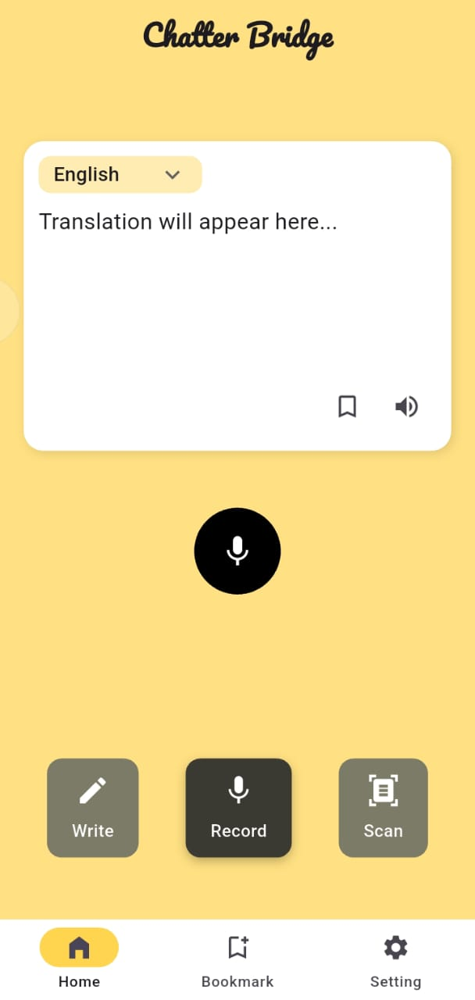
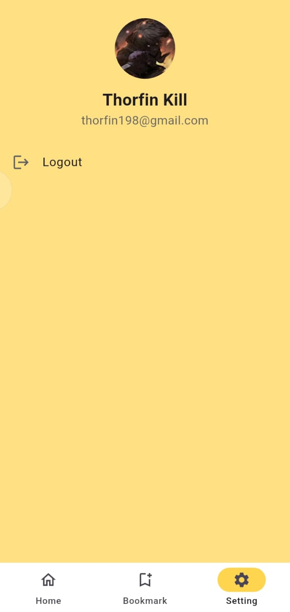

# 📱 Chatter Bridge

Chatter Bridge is a real-time messaging application built using Flutter. It allows users to connect, communicate, and collaborate seamlessly via an intuitive and responsive UI.

## 📸 Screenshots

### 🔐 Login Screen


### 🏠 Text translator


### 💬 Voice to Text


### 👤 Image Scan


### ⚙️ Settings



## 🚀 Features

- 💬 Real-time chatting between users
- 🔐 Secure login and authentication
- 🖼️ Media and file sharing (images, etc.)
- 🌓 Light and Dark Mode support
- 📲 Responsive UI for all screen sizes

## 🛠️ Technologies Used

- Flutter
- Firebase (Auth, Firestore, Storage) *(update if different)*
- Dart

## 🧑‍💻 Getting Started

To get a local copy up and running, follow these simple steps:

### Prerequisites

- Flutter SDK: [Install Flutter](https://docs.flutter.dev/get-started/install)
- Android Studio or VS Code
- Emulator or physical device

### Installation

```bash
git clone https://github.com/<your-username>/chatter_bridge.git
cd chatter_bridge
flutter pub get
flutter run
